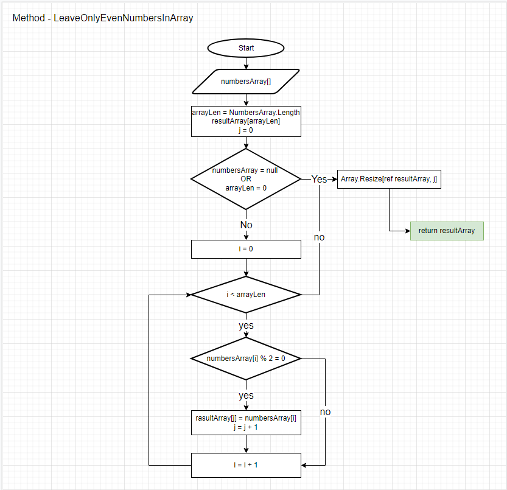

# Итоговая проверочная работа

## Программа по отсеиванию нечётных чисел из массива целых чисел

В начале нужно задать исходные данные поочерёдным вводом исходных чисел.
Для прекращения ввода чисел напишите командное слово "End".

Далее используется метод принимающий на вход исходный массив целых чисел  **numbersArray** возвращающий новый массив без нечётных элементов.

Описание работы метода (отсеивания нечётных чисел):
+ Создаём новый массив того же размера что и входной массив (на случай если все числа в нём чётные).
+ Затем осуществляем перебор элементов входного массива с проверкой их на чётность.
+ Если число чётное вносим его в новый массив.
+ Когда элементы закончились урезаем новый массив до количества четных чисел найденых в исхоном массиве.
+ Возвращаем новый массив.

[Блок-схема:](https://drive.google.com/file/d/1xE_RnsatjN7F0eci1kuHpx5mYwTn1nps/view?usp=sharing)

Автор: Сибирко Александр Евгеньевич, 29.12.2021

